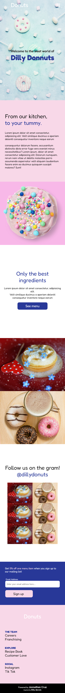
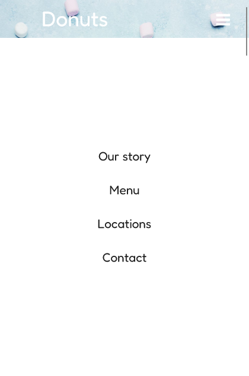
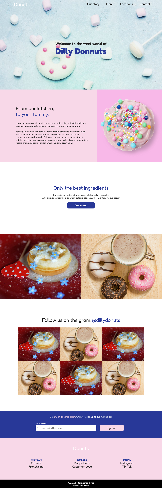
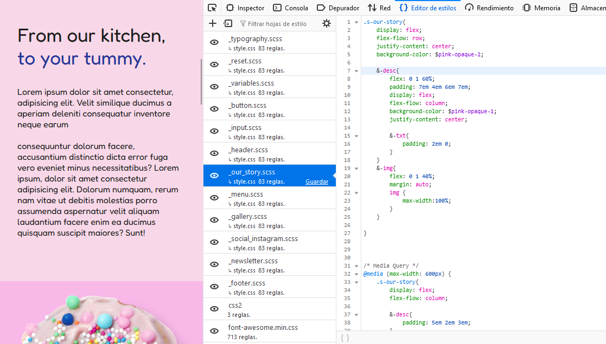

# Donut. Sass

## Descripción

Estudio personal en HTML y hojas de estilo CSS. Busco convertir la investigación en landing pages de sitios ficticios inpirados en el moodboard 'Dev' en mi [ Pinterest](https://pin.it/5y19mMg), el cual alimento y refresco contínuamente. En esta ocasión la exploración corresponde al preprocesador Sass.

Aquí puedes explorar la [Demo funcional](https://jonnathan-cruz.000webhostapp.com/portfolio/Donut-sass/index.html).
 
Y aquí puedes ver [todo mi portafolio!!!](https://jonnathan-cruz.000webhostapp.com) -> Ready to Roll Out! 

## Instalación

Solo descargar y navegar al index.html de la raíz (no requiere apache). Para realizar cambios en hojas de estilo Sass se debe contar con el entorno de compilación Sass.

## Screenshots

### Mobile:

### Desktop:

## Pruebas

Explora los estilos css en herramientas para desarrollador del navegador, específicamente en la pestaña de 'Editor de estilos' para visualizar los archivos scss.

## Licencia

Este código se distribuye bajo licencia GPLv3.

## Créditos

### Tutoriales:

- https://desarrolloweb.com/manuales/manual-sass.html
- https://sass-guidelin.es/#architecture 
- https://medium.com/codyhouse/create-your-design-system-part-1-typography-7c630d9092bd

### Inspiración principal:
https://i.pinimg.com/originals/d2/af/f4/d2aff493145707501ab016217eb74f3f.png

### Assets:
Imagen de <a href="https://pixabay.com/es/users/chiplanay-1971251/?utm_source=link-attribution&utm_medium=referral&utm_campaign=image&utm_content=4874741">chiplanay</a> en <a href="https://pixabay.com/es//?utm_source=link-attribution&utm_medium=referral&utm_campaign=image&utm_content=4874741">Pixabay</a>

Imagen de <a href="https://pixabay.com/es/users/sille23-9563537/?utm_source=link-attribution&utm_medium=referral&utm_campaign=image&utm_content=3544069">sille23</a> en <a href="https://pixabay.com/es//?utm_source=link-attribution&utm_medium=referral&utm_campaign=image&utm_content=3544069">Pixabay</a>

Imagen de <a href="https://pixabay.com/es/users/ivabalk-782511/?utm_source=link-attribution&utm_medium=referral&utm_campaign=image&utm_content=5154404">ivabalk</a> en <a href="https://pixabay.com/es//?utm_source=link-attribution&utm_medium=referral&utm_campaign=image&utm_content=5154404">Pixabay</a>

Imagen de <a href="https://pixabay.com/es/users/guvo59-9285194/?utm_source=link-attribution&utm_medium=referral&utm_campaign=image&utm_content=7588617">Gundula Vogel</a> en <a href="https://pixabay.com/es//?utm_source=link-attribution&utm_medium=referral&utm_campaign=image&utm_content=7588617">Pixabay</a>

Imagen de <a href="https://www.freepik.es/foto-gratis/vista-superior-donas-glaseadas-caramelo-malvavisco_6682116.htm#fromView=search&page=1&position=18&uuid=801fffbc-a51e-4af6-9be6-3693a36a6404">Freepik</a>

Imagen de <a href="https://pixabay.com/es/users/noname_13-2364555/?utm_source=link-attribution&utm_medium=referral&utm_campaign=image&utm_content=3665638">NoName_13</a> en <a href="https://pixabay.com/es//?utm_source=link-attribution&utm_medium=referral&utm_campaign=image&utm_content=3665638">Pixabay</a>